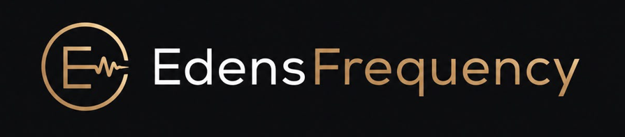

---

---

**[🏠 Home](../../README.md)** &nbsp;·&nbsp; **[🎯 About](../ABOUT.md)** &nbsp;·&nbsp; **[🚀 Products](../products/README.md)** &nbsp;·&nbsp; **[🥇 Pads](../products/pads/boom-bap-producer-pads.md)** &nbsp;·&nbsp; **[🥈 Decks](../products/decks/boom-bap-producer-decks.md)** &nbsp;·&nbsp; **[🥉 Keys](../products/key-sampler/boom-bap-producer-key-sampler.md)** &nbsp;·&nbsp; **[🔧 Technical](../technical/README.md)** &nbsp;·&nbsp; **[❓ FAQs](README.md)**

---

## 🎤 What Is "Boom Bap"?

It's a hip-hop production style that got its name from the sound itself: a hard kick ("boom") and a sharp snare ("bap"), usually built from sampled breakbeats and looped soul or jazz records. It came out of New York in the late 1980s and early '90s and still shapes how a lot of sample-based beatmaking works today, chop a record, loop the part that hits, build a drum pattern around it.

It's also where our name for this whole product line comes from: Boom Bap Producer Pads, Decks, and Key Sampler are all built around that sampling-first, hands-on workflow, even if you end up using them for something that sounds nothing like boom bap.

Want to actually build something in that style? **[Pads](../products/pads/boom-bap-producer-pads.md)** is the place to start.

---

**[🏠 Home](../../README.md)** &nbsp;·&nbsp; **[🎯 About](../ABOUT.md)** &nbsp;·&nbsp; **[🚀 Products](../products/README.md)** &nbsp;·&nbsp; **[🥇 Pads](../products/pads/boom-bap-producer-pads.md)** &nbsp;·&nbsp; **[🥈 Decks](../products/decks/boom-bap-producer-decks.md)** &nbsp;·&nbsp; **[🥉 Keys](../products/key-sampler/boom-bap-producer-key-sampler.md)** &nbsp;·&nbsp; **[🔧 Technical](../technical/README.md)** &nbsp;·&nbsp; **[❓ FAQs](README.md)**

